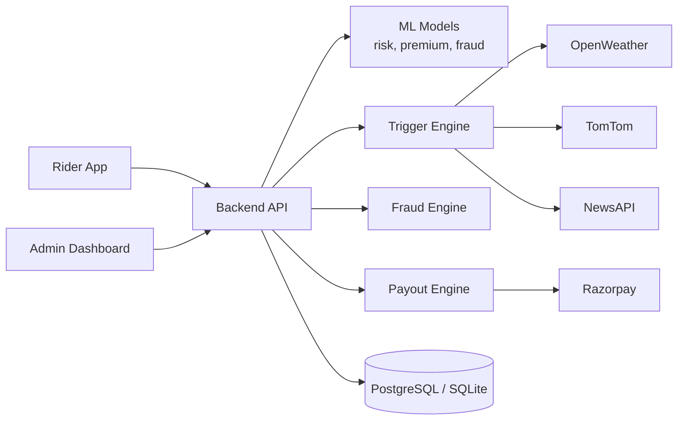
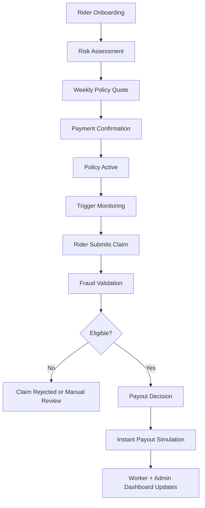

# Architecture

Auxilia is composed of three products operating against one backend API:

- Rider app (`rider_app`) for workers
- Admin dashboard (`admin_dashboard`) for insurer and operations teams
- FastAPI backend (`backend`) for policy, claims, trigger monitoring, fraud checks, and payouts

## High-Level Diagram

The diagram below reflects the current production architecture at a system level.

## Product Flow Diagram

This flow shows how a worker typically moves through the app and where automation layers apply.

## Claim Processing Flow

1. Rider submits a claim against an active policy.
2. Backend stores claim + trigger snapshot event.
3. Fraud agent runs parallel checks (location, duplicate/frequency, trigger evidence, behavior patterns).
4. If eligible, payout agent calculates payout and simulates/executes payment flow.
5. Claim and payout states are reflected in rider + admin views.

## Notes

- Trigger checks are delivery-focused and disruption-based.
- Claim prediction endpoints provide next-week likely claim estimates for insurer planning.
- Dashboard KPIs include worker-facing metrics (`earnings_protected`, `active_weekly_coverage`) and insurer-facing metrics (`loss_ratio`, forecasted claims).

## Design Principles

- **Zone-first modeling**: risk, trigger activation, and claim interpretation are anchored to zone-level conditions instead of coarse city-wide averages.
- **Short-window economics**: logic is tuned for 10-20 minute delivery cycles where small disruptions can have outsized earnings impact.
- **Multi-trigger realism**: decisions combine rain, traffic congestion, road disruptions, and low-demand surge signals rather than relying on a single weather variable.
- **Explainable automation**: claims run through explicit fraud checks before payout simulation, so both workers and admins can reason about outcomes.
- **Dual-sided visibility**: architecture supports worker confidence metrics and insurer control metrics in parallel.

## Related Docs

- Features: [FEATURES.md](FEATURES.md)
- API route groups: [API.md](API.md)
- Deployment details: [DEPLOYMENT.md](DEPLOYMENT.md)
