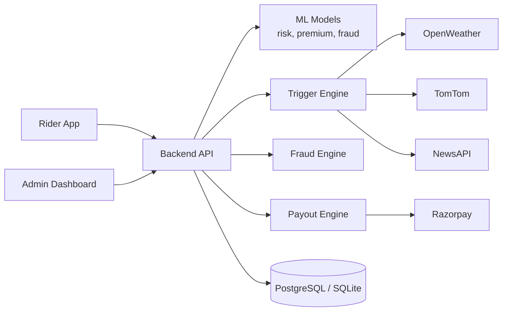
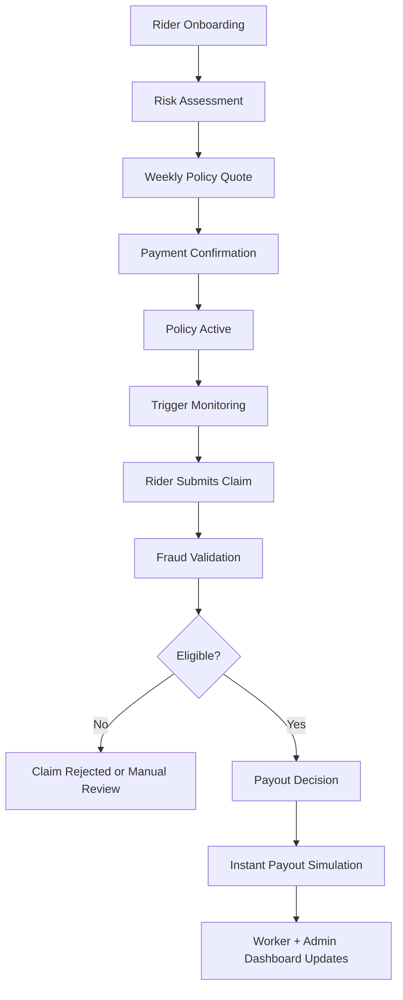

# Architecture

Auxilia has three products sharing one backend:

- Rider app (`rider_app`), the worker-facing mobile app
- Admin dashboard (`admin_dashboard`), ops and insurer tooling
- FastAPI backend (`backend`), service handling policies, claims, trigger monitoring, fraud checks, and payouts

## High-Level Diagram

The diagram below reflects the current production architecture at a system level.

## Product Flow Diagram

This flow shows how a worker typically moves through the app and where automation layers apply.

## Claim Processing Flow

1. Rider submits a claim against an active policy.
2. Backend stores claim + trigger snapshot event.
3. Fraud agent runs parallel checks (location, duplicate/frequency, trigger evidence, behavior patterns).
4. If eligible, the payout agent calculates the amount and runs the payment flow.
5. Claim and payout state update in both the rider app and admin dashboard.

## Notes

- Trigger checks are delivery-focused and disruption-based.
- Claim prediction endpoints provide next-week likely claim estimates for insurer planning.
- Dashboard KPIs include worker-facing metrics (`earnings_protected`, `active_weekly_coverage`) and insurer-facing metrics (`loss_ratio`, forecasted claims).

## Design Principles

- Everything — risk scoring, trigger activation, claim evaluation — works at the delivery-zone level. City-wide averages are too coarse for dense urban operations where two nearby zones can have very different disruption profiles.
- Pricing is tuned for 10–20 minute delivery windows. That matters because a short disruption in a high-pressure window can erase a worker's expected earnings, and standard insurance logic doesn't account for that.
- Triggers combine rainfall, traffic, road incidents, and demand drops. Not just rain.
- Fraud checks are explicit and named. Workers can see where their claim is in the process. Admins can too. There's no step that's just "under review" with no explanation.
- Worker metrics and insurer metrics run in parallel — `earnings_protected` and `active_weekly_coverage` on one side, `loss_ratio` and `claim forecasts` on the other.

## Related Docs

- Features: [FEATURES.md](FEATURES.md)
- API route groups: [API.md](API.md)
- Deployment details: [DEPLOYMENT.md](DEPLOYMENT.md)
